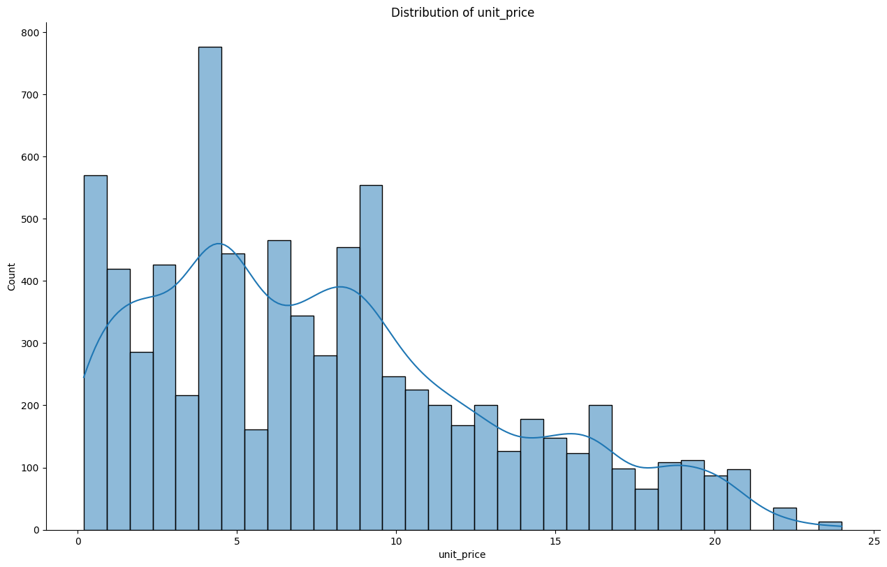
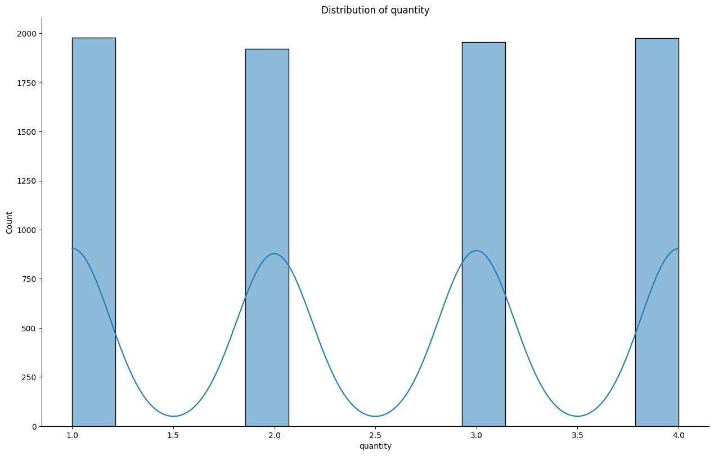
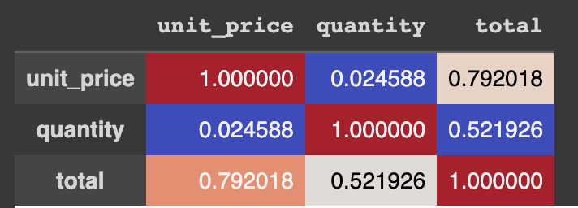
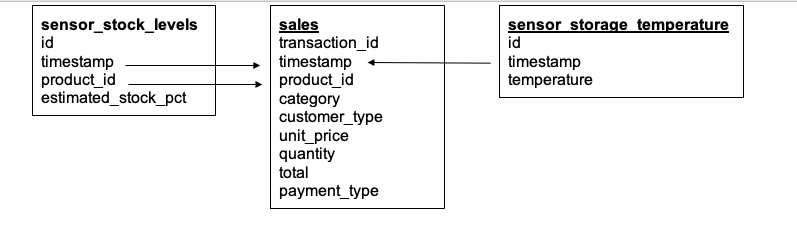
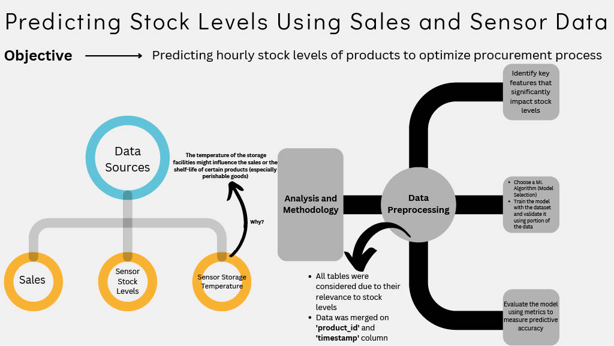
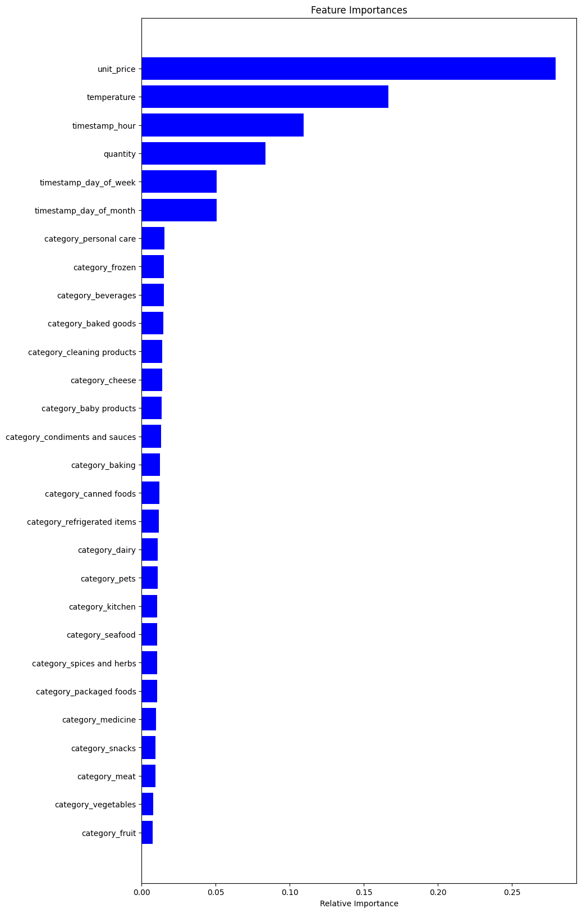

# Cognizant AI Virtual Job Simulation

Welcome to my Cognizant AI Virtual Job Simulation repository. This repository contains my work on the five tasks I completed during the Cognizant Virtual Job Simulation offered by Forage. I completed this job simulation within a week. 

## Table of Contents
1. [Introduction](#introduction)
2. [How to Use](#how-to-use)
3. [Tasks](#tasks)
   - [Task 1: Data Analysis](#task-1-data-analysis)
   - [Task 2: Data Science Process](#task-2-data-science-process)
   - [Task 3: Modeling Predictive Machine Learning Processes](#task-3-modeling-predictive-machine-learning-processes)
   - [Task 4: Develop a Python Module](#task-4-develop-a-python-module)
   - [Task 5: Evaluating the Machine Learning Model](#task-5-evaluating-the-machine-learning-model)
4. [Certificate of Completion](#certificate-of-completion)

## Introduction

This repository presents my journey through the Cognizant Virtual Job Simulation offered by Forage. 

## How to Use

Each task is organized into its own folder, with the code and related resources available for review. 

## Tasks

### Task 1: Data Analysis

**What I learned in this task:**
- How to use Python to analyze real-world datasets (e.g., transaction data from a grocery store)
- Generate insights from the data and report my findings to the Data Science Team Leader to help them better understand the business and make informed decisions
- I used `Pandas`, `Matplotlib`, and `Seaborn` libraries to analyze the data

###### Below is an example of a distribution plot generated from the `unit price` column of the dataset:

###### Below is an example of a distribution plot generated from the `quantity` column of the dataset:

###### The correlation plot below shows the correlation between the `unit price`, `quantity`, and `total` columns of the dataset:

- A correlation plot is a type of plot that shows the relationship between two variables. The correlation coefficient is a value between -1 and 1 that represents the strength of the relationship between two variables. A correlation coefficient of 1 indicates a perfect positive correlation, while a correlation coefficient of -1 indicates a perfect negative correlation. A correlation coefficient of 0 indicates no relationship between the two variables.

###### Below is an example of a count plot generated from the `category` column of the dataset:

### Task 2: Data Science Process

**What I learned in this task:**
- How to use the data science process (`CRISP-DM` and `OSEMN` Framework) to solve a real-world problem
- Developed a solution (in the form of a powerpoint presentation) to accurately predict product stock levels based on sales and sensor data.
- How to review a data model diagram and identify the data sources and data types that will be used to train a machine learning model
###### The Data Model Diagram below shows the data sources and data types that will be used to train a machine learning model:

###### The Powerpoint presentation below shows the solution I developed to accurately predict product stock levels based on sales and sensor data (This was sent to the Data Science Team Leader and Client): 

### Task 3: Modeling Predictive Machine Learning Processes
This task really challenged me as this was the first time I was exposed to machine learning. My job was to combine, transform and model datasets to answer the problem statement that the business had requested. 
**What I learned in this task:**
- I learned how to use the `scikit-learn` library to train a machine learning model to predict product stock levels based on sales and sensor data.
- `Data cleaning` by making sure that the data is in the correct format and that there are no missing values.
- `Merging` and `aggregating` data from multiple sources to create a single dataset, so that it can be used to train a machine learning model.
- `Feature engineering` by creating new features from existing features in the dataset.
- Training a `Random Forest Regressor` model to predict product stock levels based on sales and sensor data.
- Difference between `classification` and `regression` machine learning models.
- `K-fold` cross-validation to evaluate the performance of a machine learning model.
- Using `MAE` (Mean Absolute Error) and `RMSE` (Root Mean Squared Error) to evaluate the performance of a machine learning model.
- Using `matplotlib` and `numpy` to visualize the performance of the machine learning model:

### Task 4: Develop a Python Module

**<Coming Soon>**

### Task 5: Evaluating the Machine Learning Model

**<Coming Soon>**

## Certificate of Completion

